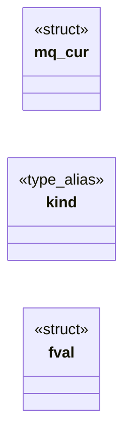
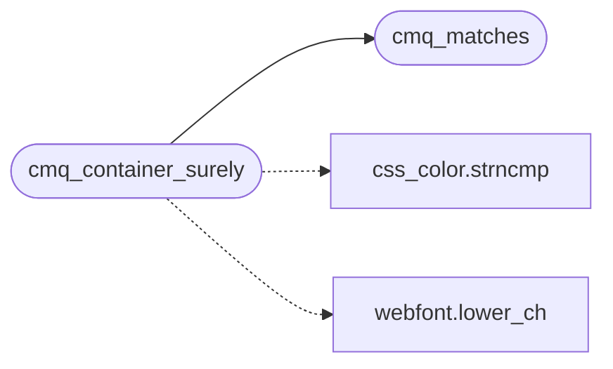

# `src/css_mq.c`

> Source: [src/css_mq.c:1](../../src/css_mq.c#L1) | language `c` | coverage 25.0% | [API index](../index.md)

## Contents

- **Structs:** [`mq_cur`](#mq_cur), [`fval`](#fval)
- **Type Aliases:** [`kind`](#kind)
- **Functions:** [`cmq_matches`](#cmq_matches), [`cmq_container_surely`](#cmq_container_surely)
- **Macros:** [`CMQ_DEVICE_W`](#cmq_device_w), [`CMQ_DPPX`](#cmq_dppx), [`CMQ_COLOR_BITS`](#cmq_color_bits), [`CMQ_DPI_PER_DPPX`](#cmq_dpi_per_dppx), [`CMQ_CM_PER_IN`](#cmq_cm_per_in), [`MQ_EPS`](#mq_eps)

## Type Diagram


```mermaid
classDiagram
    direction LR
    class mq_cur
    <<struct>> mq_cur
    class kind
    <<type_alias>> kind
    class fval
    <<struct>> fval
```

## Call Graph

Solid arrows stay in this module, dashed arrows leave it.


```mermaid
flowchart LR
    n_src_css_mq_c__cmq_container_surely(["cmq_container_surely"])
    n_src_css_mq_c__cmq_matches(["cmq_matches"])
    n_src_css_color_c__strncmp["css_color.strncmp"]
    n_src_webfont_c__lower_ch_306["webfont.lower_ch"]
    n_src_css_mq_c__cmq_container_surely --> n_src_css_mq_c__cmq_matches
    n_src_css_mq_c__cmq_container_surely -.-> n_src_css_color_c__strncmp
    n_src_css_mq_c__cmq_container_surely -.-> n_src_webfont_c__lower_ch_306
```

## Structs

<a id="mq_cur"></a>

### `mq_cur`

`struct` | [src/css_mq.c:26](../../src/css_mq.c#L26)

```c
typedef struct mq_cur
```

---

<a id="fval"></a>

### `fval`

`struct` | [src/css_mq.c:97](../../src/css_mq.c#L97)

```c
typedef struct fval
```

---

## Type Aliases

<a id="kind"></a>

### `kind`

`type_alias` | [src/css_mq.c:96](../../src/css_mq.c#L96)

```c
typedef struct fval { fv_kind kind;
```

---

## Functions

<a id="cmq_matches"></a>

### `cmq_matches`

`function` | [src/css_mq.c:460](../../src/css_mq.c#L460)

```c
int cmq_matches(const char *s, size_t len, const cmq_env *env)
```

1 iff the media query list s[0,len) matches env; malformed/unknown parts fail closed.

An empty list matches (all). NULL s or env -> 0.

**Parameters**

| Name | Type | Default | Description |
|---|---|---|---|
| `s` | `char *` |  |  |
| `len` | `size_t` |  |  |
| `env` | `cmq_env *` |  |  |

**Returns:** `int`

> **Inherited:** Documentation from [`cmq_matches`](#cmq_matches) (include/css_mq.h:28).

*Called by:* [`cmq_container_surely`](#cmq_container_surely)

---

<a id="cmq_container_surely"></a>

### `cmq_container_surely`

`function` | [src/css_mq.c:491](../../src/css_mq.c#L491)

```c
int cmq_container_surely(const char *s, size_t len, int max_width)
```

@container condition s[0,len) (optionally led by a container name) is SURELY true for every container no wider than max_width: it must be a pure width interval (width/inline-size comparisons joined by `and`) true at width 0 and at max_width.

Anything else -- or, not, height, style(), unknown -- is 0. spec/css_mq.md.

**Parameters**

| Name | Type | Default | Description |
|---|---|---|---|
| `s` | `char *` |  |  |
| `len` | `size_t` |  |  |
| `max_width` | `int` |  |  |

**Returns:** `int`

> **Inherited:** Documentation from [`cmq_container_surely`](#cmq_container_surely) (include/css_mq.h:34).

*Calls:* [`strncmp`](src.css_color.c.md#strncmp), [`cmq_matches`](#cmq_matches), [`lower_ch`](src.webfont.c.md#lower_ch)

---

## Macros

<a id="cmq_device_w"></a>

### `CMQ_DEVICE_W`

`macro` | [src/css_mq.c:19](../../src/css_mq.c#L19)

```c
#define CMQ_DEVICE_W
```

The device the engine claims to be (anti-fingerprinting): never measured.

---

<a id="cmq_dppx"></a>

### `CMQ_DPPX`

`macro` | [src/css_mq.c:21](../../src/css_mq.c#L21)

```c
#define CMQ_DPPX
```

---

<a id="cmq_color_bits"></a>

### `CMQ_COLOR_BITS`

`macro` | [src/css_mq.c:22](../../src/css_mq.c#L22)

```c
#define CMQ_COLOR_BITS
```

---

<a id="cmq_dpi_per_dppx"></a>

### `CMQ_DPI_PER_DPPX`

`macro` | [src/css_mq.c:23](../../src/css_mq.c#L23)

```c
#define CMQ_DPI_PER_DPPX
```

---

<a id="cmq_cm_per_in"></a>

### `CMQ_CM_PER_IN`

`macro` | [src/css_mq.c:24](../../src/css_mq.c#L24)

```c
#define CMQ_CM_PER_IN
```

---

<a id="mq_eps"></a>

### `MQ_EPS`

`macro` | [src/css_mq.c:205](../../src/css_mq.c#L205)

```c
#define MQ_EPS
```

---
