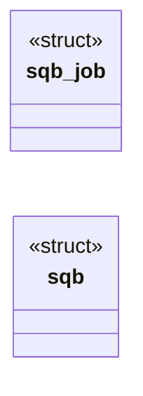
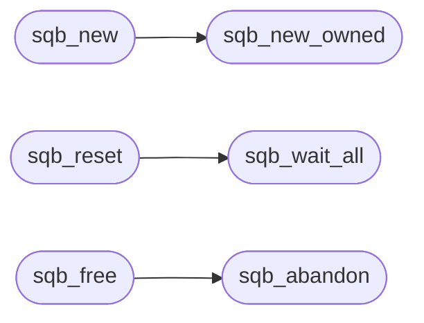

# `src/subreq_batch.c`

> Source: [src/subreq_batch.c:1](../../src/subreq_batch.c#L1) | language `c` | coverage 66.7% | [API index](../index.md)

## Contents

- **Structs:** [`sqb_job`](#sqb_job), [`sqb`](#sqb)
- **Functions:** [`sqb_new`](#sqb_new), [`sqb_new_owned`](#sqb_new_owned), [`sqb_submit`](#sqb_submit), [`sqb_count`](#sqb_count), [`sqb_wait_all`](#sqb_wait_all), [`sqb_wait_ready`](#sqb_wait_ready), [`sqb_remove`](#sqb_remove), [`sqb_result`](#sqb_result), [`sqb_reset`](#sqb_reset), [`sqb_abandon`](#sqb_abandon), [`sqb_free`](#sqb_free)
- **Macros:** [`_GNU_SOURCE`](#_gnu_source)

## Type Diagram


```mermaid
classDiagram
    direction LR
    class sqb_job
    <<struct>> sqb_job
    class sqb
    <<struct>> sqb
```

## Call Graph

Solid arrows stay in this module, dashed arrows leave it.


```mermaid
flowchart LR
    n_src_subreq_batch_c__sqb_new(["sqb_new"])
    n_src_subreq_batch_c__sqb_new_owned(["sqb_new_owned"])
    n_src_subreq_batch_c__sqb_reset(["sqb_reset"])
    n_src_subreq_batch_c__sqb_wait_all(["sqb_wait_all"])
    n_src_subreq_batch_c__sqb_free(["sqb_free"])
    n_src_subreq_batch_c__sqb_abandon(["sqb_abandon"])
    n_src_subreq_batch_c__sqb_new --> n_src_subreq_batch_c__sqb_new_owned
    n_src_subreq_batch_c__sqb_reset --> n_src_subreq_batch_c__sqb_wait_all
    n_src_subreq_batch_c__sqb_free --> n_src_subreq_batch_c__sqb_abandon
```

## Structs

<a id="sqb_job"></a>

### `sqb_job`

`struct` | [src/subreq_batch.c:11](../../src/subreq_batch.c#L11)

```c
typedef struct sqb_job
```

---

<a id="sqb"></a>

### `sqb`

`struct` | [src/subreq_batch.c:23](../../src/subreq_batch.c#L23)

```c
struct sqb
```

---

## Functions

<a id="sqb_new"></a>

### `sqb_new`

`function` | [src/subreq_batch.c:97](../../src/subreq_batch.c#L97)

```c
sqb *sqb_new(int max_threads, sqb_run_fn run, void *ctx)
```

**Parameters**

| Name | Type | Default | Description |
|---|---|---|---|
| `max_threads` | `int` |  |  |
| `run` | `sqb_run_fn` |  |  |
| `ctx` | `void *` |  |  |

**Returns:** `sqb *`

*Calls:* [`sqb_new_owned`](#sqb_new_owned)

---

<a id="sqb_new_owned"></a>

### `sqb_new_owned`

`function` | [src/subreq_batch.c:101](../../src/subreq_batch.c#L101)

```c
sqb *sqb_new_owned(int max_threads, sqb_run_fn run, void *ctx, void (*free_ctx)(void *))
```

sqb_new whose ctx the batch OWNS: free_ctx(ctx) runs once the batch is freed AND every abandoned request has finished -- the run callback may use ctx until then.

**Parameters**

| Name | Type | Default | Description |
|---|---|---|---|
| `max_threads` | `int` |  |  |
| `run` | `sqb_run_fn` |  |  |
| `ctx` | `void *` |  |  |
| `void` | `void (*free_ctx)( *)` |  |  |

**Returns:** `sqb *`

> **Inherited:** Documentation from [`sqb_new_owned`](#sqb_new_owned) (include/subreq_batch.h:40).

*Called by:* [`sqb_new`](#sqb_new)

---

<a id="sqb_submit"></a>

### `sqb_submit`

`function` | [src/subreq_batch.c:127](../../src/subreq_batch.c#L127)

```c
int sqb_submit(sqb *b, int refused, const sqb_req *req)
```

Queues one request. refused != 0 queues a ready-made failure (no thread, no fetch) so the result count always equals the submit count.

Returns 0, or -1 when full / out of memory (nothing queued: the caller must answer the worker itself).

**Parameters**

| Name | Type | Default | Description |
|---|---|---|---|
| `b` | `sqb *` |  |  |
| `refused` | `int` |  |  |
| `req` | `sqb_req *` |  |  |

**Returns:** `int`

> **Inherited:** Documentation from [`sqb_submit`](#sqb_submit) (include/subreq_batch.h:47).

---

<a id="sqb_count"></a>

### `sqb_count`

`function` | [src/subreq_batch.c:154](../../src/subreq_batch.c#L154)

```c
size_t sqb_count(const sqb *b)
```

**Parameters**

| Name | Type | Default | Description |
|---|---|---|---|
| `b` | `sqb *` |  |  |

**Returns:** `size_t`

---

<a id="sqb_wait_all"></a>

### `sqb_wait_all`

`function` | [src/subreq_batch.c:156](../../src/subreq_batch.c#L156)

```c
void sqb_wait_all(sqb *b)
```

Joins every running request.

**Parameters**

| Name | Type | Default | Description |
|---|---|---|---|
| `b` | `sqb *` |  |  |

> **Inherited:** Documentation from [`sqb_wait_all`](#sqb_wait_all) (include/subreq_batch.h:50).

*Called by:* [`sqb_reset`](#sqb_reset)

---

<a id="sqb_wait_ready"></a>

### `sqb_wait_ready`

`function` | [src/subreq_batch.c:169](../../src/subreq_batch.c#L169)

```c
size_t sqb_wait_ready(sqb *b, long wait_ms, size_t *idx, size_t cap)
```

Waits until every request finished or `wait_ms` elapsed (0 = do not wait), then writes the indices of EVERY finished request, ascending, into idx (at most cap) and returns how many (spec/subreq_async.md, "Entrega con plazo").

Those results are valid through sqb_result.

**Parameters**

| Name | Type | Default | Description |
|---|---|---|---|
| `b` | `sqb *` |  |  |
| `wait_ms` | `long` |  |  |
| `idx` | `size_t *` |  |  |
| `cap` | `size_t` |  |  |

**Returns:** `size_t`

> **Inherited:** Documentation from [`sqb_wait_ready`](#sqb_wait_ready) (include/subreq_batch.h:56).

---

<a id="sqb_remove"></a>

### `sqb_remove`

`function` | [src/subreq_batch.c:191](../../src/subreq_batch.c#L191)

```c
void sqb_remove(sqb *b, const size_t *idx, size_t k)
```

Joins and frees the jobs at the k ascending indices (unfinished or out-of-range ones are skipped); the others keep running and keep their relative order.

**Parameters**

| Name | Type | Default | Description |
|---|---|---|---|
| `b` | `sqb *` |  |  |
| `idx` | `size_t *` |  |  |
| `k` | `size_t` |  |  |

> **Inherited:** Documentation from [`sqb_remove`](#sqb_remove) (include/subreq_batch.h:59).

---

<a id="sqb_result"></a>

### `sqb_result`

`function` `const` | [src/subreq_batch.c:213](../../src/subreq_batch.c#L213)

```c
const sqb_res *sqb_result(const sqb *b, size_t i)
```

Valid after sqb_wait_all, for i < sqb_count.

**Parameters**

| Name | Type | Default | Description |
|---|---|---|---|
| `b` | `sqb *` |  |  |
| `i` | `size_t` |  |  |

**Returns:** `sqb_res *`

> **Inherited:** Documentation from [`sqb_result`](#sqb_result) (include/subreq_batch.h:52).

---

<a id="sqb_reset"></a>

### `sqb_reset`

`function` | [src/subreq_batch.c:217](../../src/subreq_batch.c#L217)

```c
void sqb_reset(sqb *b)
```

Joins (waits for) and frees every job and result; the batch is reusable.

**Parameters**

| Name | Type | Default | Description |
|---|---|---|---|
| `b` | `sqb *` |  |  |

> **Inherited:** Documentation from [`sqb_reset`](#sqb_reset) (include/subreq_batch.h:61).

*Calls:* [`sqb_wait_all`](#sqb_wait_all)

---

<a id="sqb_abandon"></a>

### `sqb_abandon`

`function` | [src/subreq_batch.c:224](../../src/subreq_batch.c#L224)

```c
void sqb_abandon(sqb *b)
```

Frees every finished job and ABANDONS every running one: its thread is detached, its result is discarded when it ends, and nothing here waits.

The batch is empty and reusable.

**Parameters**

| Name | Type | Default | Description |
|---|---|---|---|
| `b` | `sqb *` |  |  |

> **Inherited:** Documentation from [`sqb_abandon`](#sqb_abandon) (include/subreq_batch.h:43).

*Called by:* [`sqb_free`](#sqb_free)

---

<a id="sqb_free"></a>

### `sqb_free`

`function` | [src/subreq_batch.c:247](../../src/subreq_batch.c#L247)

```c
void sqb_free(sqb *b)
```

Abandons what is still running (sqb_abandon) and releases the batch; the memory goes when the last abandoned request ends.

Never waits.

**Parameters**

| Name | Type | Default | Description |
|---|---|---|---|
| `b` | `sqb *` |  |  |

> **Inherited:** Documentation from [`sqb_free`](#sqb_free) (include/subreq_batch.h:64).

*Calls:* [`sqb_abandon`](#sqb_abandon)

---

## Macros

<a id="_gnu_source"></a>

### `_GNU_SOURCE`

`macro` | [src/subreq_batch.c:2](../../src/subreq_batch.c#L2)

```c
#define _GNU_SOURCE
```

subreq_batch -- see include/subreq_batch.h and spec/subreq_async.md.

---
