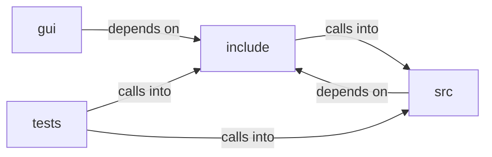

# include: svg_render

include: svg_render groups 16 files (c, h) around FREEDOM_IMAGE_DECODE_H, guards, img_format, img_status, img_pixels. ui_theme_mode: ui_rgb button_text; ui_rgb menu_bg; ui_rgb menu_border; ui_rgb...

```mermaid
graph LR
    gui["gui"]
    include["include"]
    src["src"]
    tests["tests"]
    gui -- "depends on" --> include
    include -- "calls into" --> src
    src -- "depends on" --> include
    tests -- "calls into" --> include
    tests -- "calls into" --> src
```

## gui (7.1)

gui groups 3 files (c, h) around FREEDOM_BROWSER_UI_INTERNAL_H, UI_FONT_SIZE, UI_TEXT_MARGIN, UI_HEADING_LEVELS, b. ui_theme_mode: ui_rgb button_text; ui_rgb menu_bg; ui_rgb menu_border; ui_rgb...

## include (7.2)

include groups 5 files (h) around FREEDOM_IMAGE_DECODE_H, guards, img_format, img_status, img_pixels. img_pixels: A decoded bitmap that owns its pixel buffer.

## src (7.3)

src groups 4 files (c) around exit, PNG_IHDR_MIN, read_be32, img_png_dimensions, img_dimensions_ok. jpeg_err_ctx: libjpeg error manager that longjmps instead of calling exit(), so a...

## tests (7.4)

tests groups 4 files (c) around _DEFAULT_SOURCE, _POSIX_C_SOURCE, FREEDOM_BIN, OUT_FILE, ERR_FILE. run_freedom_raw: Runs the binary with a raw argument string (no implicit --headless)...

**Files**:

- gui/browser_ui_internal.h
- gui/bui_theme.c
- gui/ui_render.c
- include/freedom_config.h
- include/image_decode.h
- include/svg_paint.h
- include/svg_raster.h
- include/svg_render.h
- src/image_decode.c
- src/svg_paint.c
- src/svg_raster.c
- src/svg_render.c
- tests/test_freedom.c
- tests/test_image_decode.c
- tests/test_svg_raster.c
- tests/test_svg_render.c
